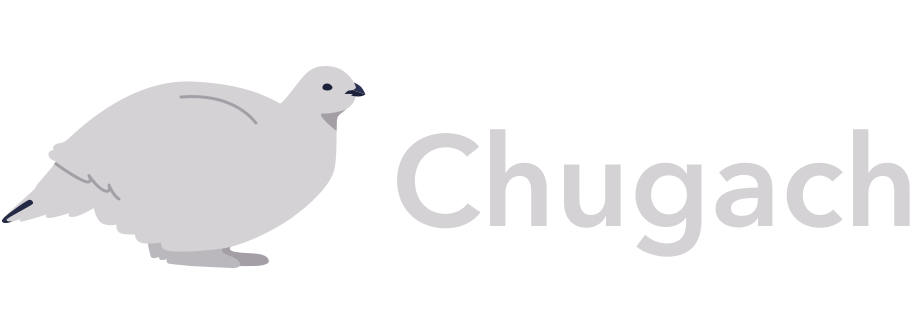
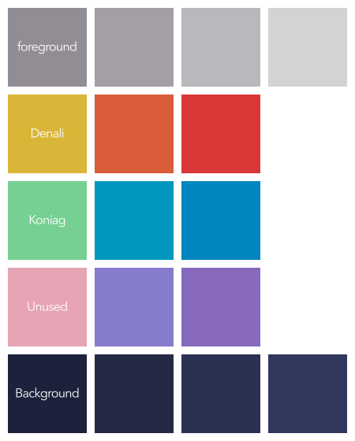
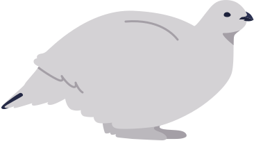
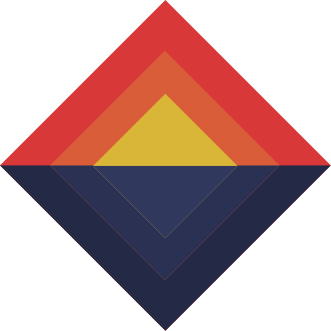
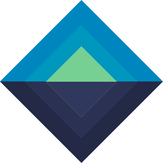

# Chugach Branding

Branding for the Chugach organization.
All of our assets are kept and designed [on Figma](https://www.figma.com/design/KAtHrFddH26RhPOnpQNMQU/Denali?node-id=1-6&t=PslGZtUwplDB4Cev-1)

## Colors

Each project under the Chugach organization gets its own unique color palette. The presence of a color from a project's pallete should always mean that that project is involved. e.g using the Denali colors on a link to the Koniag repo is not allowed.

This pallete is designed to be used for a dark theme.

## Logos

The logo/mascott of Chugach is the Willow Ptarmagin (the state bird of Alaska).

The logos of Koniag and Denali are simple constructions of squares that showcase the project's unique pallete.

    
    

## Fonts

Avenir Next LT Pro Demi is used as the display font in logos and titles. The regular variant is used for subtext in logos.

<!-- Determine body/monospaced font -->
